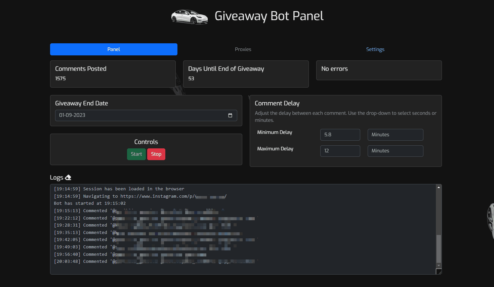
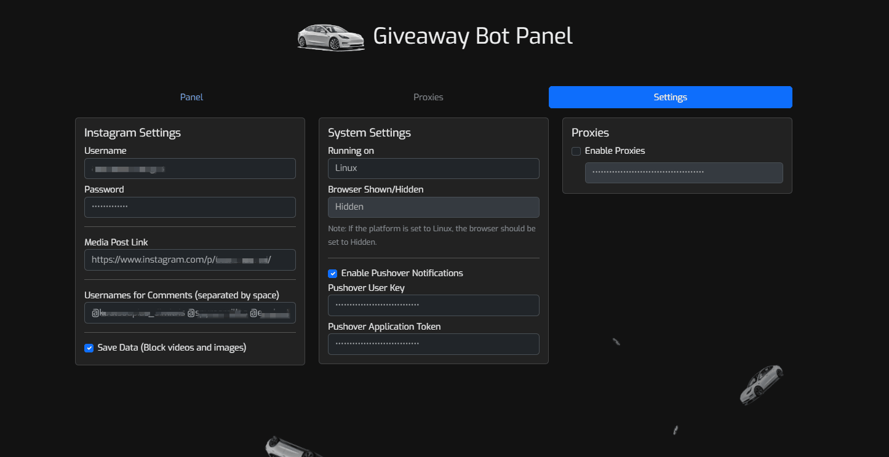
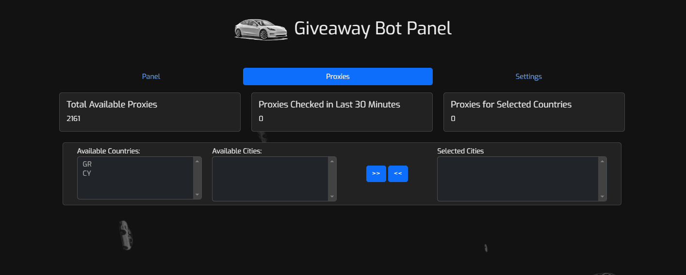

<a name="readme-top"></a>
[![Contributors][contributors-shield]][contributors-url]
[![Forks][forks-shield]][forks-url]
[![Stargazers][stars-shield]][stars-url]
[![Issues][issues-shield]][issues-url]
[![MIT License][license-shield]][license-url]
[![LinkedIn][linkedin-shield]][linkedin-url]

<br />
<div align="center">
  <a href="https://github.com/alexandrosmagos/instagram_commenter_ui">
    
  </a>

  <h3 align="center">Instagram Giveaway Commenter</h3>

  <p align="center">
    An automated Instagram commenter bot built with Node.js and Puppeteer!
    <br />
    <a href="https://github.com/alexandrosmagos/instagram_commenter_ui/issues">Report Bug</a>
    ·
    <a href="https://github.com/alexandrosmagos/instagram_commenter_ui/issues">Request Feature</a>
  </p>
</div>

<details>
  <summary>Table of Contents</summary>
  <ol>
    <li>
      <a href="#about-the-project">About The Project</a>
      <ul>
        <li><a href="#built-with">Built With</a></li>
      </ul>
    </li>
    <li>
      <a href="#getting-started">Getting Started</a>
      <ul>
        <li><a href="#prerequisites">Prerequisites</a></li>
        <li><a href="#installation">Installation</a></li>
      </ul>
    </li>
    <li><a href="#usage">Usage</a></li>
    <li><a href="#roadmap">Roadmap</a></li>
    <li><a href="#screenshots">Screenshots</a></li>
    <li><a href="#contributing">Contributing</a></li>
    <li><a href="#bot-operation-and-error-management ">Bot Operation and Error Management</a></li>
    <li><a href="#contact">Contact</a></li>
    <li><a href="#license">License</a></li>
    <li><a href="#disclaimer-amp;-acknowledgement">Disclaimer & Acknowledgement</a></li>
    <li><a href="#credits">Credits</a></li>
  </ol>
</details>

## About The Project

This project aims to provide a simple and customizable bot to automate commenting on Instagram giveaway posts.

## Features

Instagram Giveaway Commenter is a tool that automates the process of participating in Instagram giveaways. Here's an overview of its features:

1. **One Page Design**: The application features a one-page design that provides a faster and prettier user interface, facilitating better user experience.

2. **User Authentication**: The tool supports user registration and authentication. This feature makes it feasible for users to host this application on a Windows, Mac, or Linux system and forward it or set it up on a private domain. This allows for easier access, management, and monitoring.

3. **Automated Commenting**: It automatically posts comments on giveaway posts on Instagram based on the user's settings.

4. **Time Management**: The tool manages comment timings and can delay the next comment based on user-defined minimum and maximum delay values. It avoids spam detection by checking if enough time has passed since the last comment before proceeding with the next one.

5. **Proxy Management**: It allows the use of proxies. The user can enable or disable the proxy usage. In case the proxy is enabled, the tool provides an option to select the desired country and city from a list of available options. **Not Yet Finished**

6. **Error Management**: The tool handles errors such as Instagram's 429 error (too many requests) gracefully, by implementing delays and resuming operation when feasible. It also displays the time elapsed since the last 429 error.

7. **Activity Logs**: The tool maintains logs of its operation which the user can view and clear as needed.

8. **Customization**: The tool allows the user to customize various settings such as Instagram username and password, media link for the giveaway post, stop date for commenting, and pushover notification preferences.

9. **Pushover Notifications**: The tool supports sending notifications to the user's device via Pushover, if the user has enabled this option and provided their Pushover user key and application token.

Remember that this tool is intended for responsible use. Please be aware that using it in a way that violates Instagram's community guidelines or engages in spam-like activity goes against Instagram's Terms of Service (TOS). For more information, please refer to the Disclaimer & Acknowledgement section.

### Built With

* [Node.js](https://nodejs.org/)
* [Puppeteer](https://pptr.dev/)
* [Socket.IO](https://socket.io/)
* [Express](https://expressjs.com/)
* [dotenv](https://www.npmjs.com/package/dotenv)

## Getting Started

To get a local copy up and running, follow these simple steps:

### Prerequisites

This project requires Node.js and npm. You can install them from the official [Node.js website](https://nodejs.org/).

### Installation

1. Clone the repository
   ```sh
   git clone https://github.com/alexandrosmagos/instagram_commenter_ui.git
   
2. Navigate to the project directory
   ```sh
    cd instagram_commenter_ui
   
3. Install the dependencies
   ```sh
    npm install

4. Rename the `.env example` file to `.env`, and change the `session_secret` string. The app will work without this, but it is recommended to change it for security reasons. You can also enter your instagram credentials here, or from the UI later.
   
5. Start the application by running `'node server'` in your terminal

## How to update

If you want to update the bot, you can simply run the following commands:
1. `git pull origin main`
2. `npm install` This is optional, but recommended, as to update the dependencies.

## Usage

After starting the application, you can access the user interface from your web browser by navigating to one of the links printed on the console, or simply `http://localhost:3000`. 

The first page to automatically load up should be the register page. Once registered, the register page won't show up again.

After logging in, fill in the required fields such as the Instagram username and password, the URL of the post, the delay range for the comments, and the usernames for the tags, for the giveaway.

Note after setting or changing your (instagram, pushover, discord webhook) credentials, a restart is required in order for them to take effect.

After everything is set, press the "Start" button to start the bot. If there are any missing parameters, the bot stops and mentions what is missing. You can also modify various parameters in the UI to your liking.

If you would like to change the theme's image, just change the image in `public/theme.png` image with a transparent image of whatever you want.

## Roadmap

- Note that the current version of the bot does not have proxy support integrated yet. This is a planned feature for a future release.

- Also, there is currently no automated handling of Two-Factor Authentication (2FA) during the login process. If 2FA pop up while the bot log in, it will probably just stay there. This is another area where enhancements are planned for future releases.

See the [open issues](https://github.com/alexandrosmagos/instagram_commenter_ui/issues) for a list of proposed features (and known issues).


## Screenshots

Here are some screenshots that show the main functionality of the Instagram Giveaway Commenter:

### Main Panel Tab

Here is where you manage and monitor the bot's activity. It features live logs and counters, Start / Stop bot control, and more.

### Settings Tab

You can adjust various parameters here, like Instagram credentials, the link to the Instagram post you want to comment on, and more.

### Proxies Tab

Manage your proxies. You can add, update, and delete proxies. You can also validate the proxy settings here.


## Bot Operation and Error Management 

This bot works by making requests to Instagram's servers, imitating a user's interaction with the website. It uses an advanced browser automation library (Puppeteer) to drive these interactions.

The bot has several built-in mechanisms to handle various scenarios and server responses to ensure its operation is as smooth as possible and longevity. Here are some key points:

<dl>
  <dt>1. 400 Errors (Bad Request)</dt>
  <dd>When the bot receives a 400 error from Instagram's servers, it checks if the error is related to a 'spam' flag on the bot's activity. Instagram can sometimes detect bot activity and mark it as spam, imposing a temporary block on commenting. <br />
  In such cases, the bot will enter a pause mode and stop all activity until the specified date in the 'feedback_message' returned in Instagram's response. The bot can parse a date string from the feedback message and calculate the delay required.</dd>


<dt>2. 429 Errors (Too Many Requests)</dt>
<dd>A 429 status code means that the bot has exceeded the rate limits imposed by Instagram. To mitigate this, the bot enters a pause state for 30 minutes upon receiving a 429 status code. During this pause, all activity is halted to ensure compliance with Instagram's rate limits. <br />
In addition to this, the bot also keeps track of the last time it received a 429 status code. This information can be used to identify patterns and adjust the bot's behavior to prevent future rate limit exceedances.</dd>


<dt>3. 401 Errors (Unauthorized)</dt>
<dd>If a 401 error is received, it means the session's authentication has expired or is otherwise invalid. To fix this, the bot re-authenticates by logging back in.</dd>

<dt>4. Session Management and Cookies</dt>
<dd>The bot also utilizes cookies to maintain a session with Instagram. If the bot has previous cookies stored, it will load them into the browser before starting operations. However, if the cookies are expired, the bot will perform a new login to get a fresh set of cookies.<br />
The bot continually checks and updates the cookies file with the current session's cookies to ensure a smooth operation for longer periods of time.</dd>

<dt>5. Adaptive Delays</dt>
<dd>To simulate human behavior more accurately and to adhere to Instagram's usage policies, the bot employs adaptive delays between actions (like posting comments). These delays are not fixed but rather randomly determined within a defined range to make the bot's activity pattern less predictable and more human-like. This can help evade Instagram's anti-bot mechanisms.<br />

The delay range can be specified in either seconds or minutes and the actual delay is calculated at runtime. The bot keeps track of the last time it commented and checks against the delay to decide if it should comment again.</dd>

</dl>
This bot is designed with the goal of longevity and sustainability in mind, rather than short-term aggressive activity, which can lead to permanent bans.


## Contributing

Contributions are what make the open-source community such an amazing place to learn, inspire, and create. Any contributions you make are greatly appreciated.

To contribute:

1. Fork the Project
2. Create your Feature Branch (git checkout -b feature/AmazingFeature)
3. Commit your Changes (git commit -m 'Add some AmazingFeature')
4. Push to the Branch (git push origin feature/AmazingFeature)
5. Open a Pull Request


## License

This project is licensed under the AGPL-3.0 License. For more information, please refer to the [LICENSE](LICENSE) file in the repository.

## Disclaimer & Acknowledgement

This project is intended for educational and research purposes only. It demonstrates the capabilities of automation and how it can be utilized to perform certain tasks. The utilization of this project for automating actions on Instagram is contrary to the Instagram Terms of Service. Consequently, users who decide to use this software application should do so at their own risk. I, as the author, do not endorse or promote the use of this project for purposes that violate Instagram's Terms of Service and cannot be held responsible for any misuse or any potential damages arising from such misuse.

## Credits

This project wouldn't be the same without the fantastic animated background it uses. The initial animation had cubes and was a beautiful addition to the project. The cubes were later changed to Teslas to match the theme of the giveaway, which inspired this project.

The animated background was created by Mohammad Abdul Mohaiman. You can find the original work on [Codepen](https://codepen.io/mohaiman/pen/MQqMyo).

[contributors-shield]: https://img.shields.io/github/contributors/alexandrosmagos/instagram_commenter_ui.svg?style=for-the-badge
[contributors-url]: https://github.com/alexandrosmagos/instagram_commenter_ui/graphs/contributors
[forks-shield]: https://img.shields.io/github/forks/alexandrosmagos/instagram_commenter_ui.svg?style=for-the-badge
[forks-url]: https://github.com/alexandrosmagos/instagram_commenter_ui/network/members
[stars-shield]: https://img.shields.io/github/stars/alexandrosmagos/instagram_commenter_ui.svg?style=for-the-badge
[stars-url]: https://github.com/alexandrosmagos/instagram_commenter_ui/stargazers
[issues-shield]: https://img.shields.io/github/issues/alexandrosmagos/instagram_commenter_ui.svg?style=for-the-badge
[issues-url]: https://github.com/alexandrosmagos/instagram_commenter_ui/issues
[license-shield]: https://img.shields.io/github/license/alexandrosmagos/instagram_commenter_ui.svg?style=for-the-badge
[license-url]: https://github.com/alexandrosmagos/instagram_commenter_ui/blob/master/LICENSE
[linkedin-shield]: https://img.shields.io/badge/-LinkedIn-black.svg?style=for-the-badge&logo=linkedin&colorB=555
[linkedin-url]: https://linkedin.com/in/alexandrosmagos
